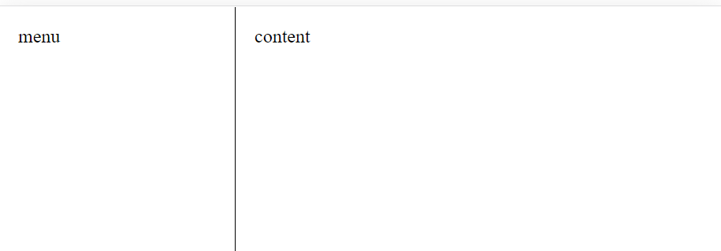
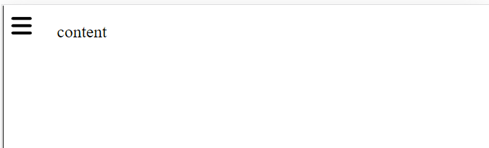
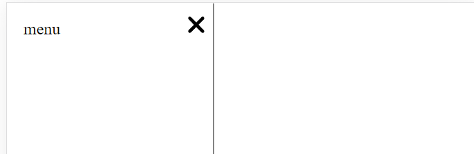

# 100% CSS | Side Menu Bar

## はじめに

ググればコードがヒットしそうですが、頑張って0から作成してみました。  
CSSの`:has()`を利用するため、サポートされていないブラウザでは機能しませんので、ご注意ください。

## 動作

横幅がしきい値を超える場合、メニュー領域とコンテンツ領域は横並びになります。  
  

横幅がしきい値を下回る場合、メニュー領域は閉じられ、表示切替用のボタンが登場します。  
  

ボタンクリックによるメニュー表示はコンテンツ領域に重なるように描画されます。  
  

## 作成の軌跡

### HTML部分を作成する

メニュー領域、コンテンツ領域、切替ボタンを作成します。  
ボタンはon/offの2値を取り扱うので、チェックボックスにしています。  
※アイコンは[Font Awesome](https://fontawesome.com/icons)から取得しました。
```html
<div class="container">
    <div class="side area">
        <div>menu</div>
    </div>
    <div class="content area">
        <div>content</div>
    </div>
    <div class="button">
        <div>
            
            
            <input
                class="toggle-menu"
                type="checkbox"
                name="toggle-menu"
            >
        </div>
    </div>
</div>
```

### 基本レイアウトを作成する

#### リセットCSS

余計なCSSをクリアします。
```css
* {
    margin: 0;
    padding: 0;
    box-sizing: border-box;
}
```

#### `container`へのCSS

各子要素を絶対位置指定で描画するため、`position`を`relative`にします。  
`height`はてきとーです。
```css
.container {
    height: 100vh;
    position: relative;

　　& > * {
        position: absolute;
        top: 0;
    }
}
```

#### メニュー領域とコンテンツ領域に共通のCSS

`container`と高さを合わせ、縦スクロールのみ許可します。  
横スクロールを許可しないのは[WCAG2.2](https://www.w3.org/TR/WCAG22/#reflow)のreflowを考慮してです。  
各領域が記述する内容が見やすくなるように`padding`をてきとーに与えます。
```css
.area {
    bottom: 0;
    overflow-x: hidden;
    overflow-y: auto;

    & > div {
        padding: 1rem;
    }
}
```

#### メニュー領域のCSS

状況に応じて見た目が変化しますが、いったん固定で作っておきます。  
コンテンツ領域に重なる予定なので、`background-color`と`z-index`を指定。  
```css
.side {
    left: 0;
    width: 200px;
    border-right: 1px solid black;
    background-color: white;
    z-index: 1;
}
```

#### コンテンツ領域のCSS

こちらも仮の状態です。  
メニュー領域を考慮して、`left`を調整します。
```css
.content {
    left: 200px;
    right: 0;
}
```

#### ボタンのCSS

同じく仮の状態。  
`width: 0px;`の指定で、画面上には見えません。  
また、メニュー領域の上にボタンを描画したいので、`z-index`を調整しています。  
一番のポイントは、チェックボックスの状態でアイコンの高さを変更している点です。  
表示用のアイコンと閉じる用のアイコンのどちらかが見えなくなるようになっています。  
肝心のチェックボックスは、透明にしてアイコンの上に重ねています。  
アイコンをクリックすると、実際にはアイコンの上にあるチェックボックスをクリックします。
```css
.button {
    width: 0px;
    overflow: hidden;
    z-index: 2;

    & > div {
        padding: 0.5rem;
        display: flex;
        flex-direction: column;

        & .show {
            height: auto;

            &:has(~ .toggle-menu:checked) {
                height: 0;
            }
        }

        & .hide {
            height: 0;

            &:has(~ .toggle-menu:checked) {
                height: auto;
            }
        }

        & .toggle-menu {
            position: absolute;
            inset: 0;
            opacity: 0;
        }
    }
}
```

### 状況に応じて変化させる

メニュー領域の幅や、ボタンの幅などは、固定ではなく状況に応じて変化する値です。  
これをCSS関数を用いて実現します。  
まずは、必要そうな値をCSSカスタムプロパティに設定します。
```css
.container {
    --threshold: 480px; /* しきい値 */
    --menu-size: 200; /* メニュー領域の幅 */
    --button-size: 35; /* ボタンの幅 */
}
```

しきい値前後で値が変化するカスタムプロパティを作成します。  
`.container`の確保できる幅としきい値の差が使えそうです。  
なお、差が小さい場合でも問題ないように、大きな値をかけておきます。  
あとは、`clamp`関数で最小値と最大値を指定すれば完成です。  
しきい値を超える幅なら`1px`に、下回るなら`0px`になります。  
※0～1の間の値になる可能性は存在しますが、稀なので無視します。
```css
.container {
    --side-base-width: clamp(0px, calc((100% - var(--threshold)) * 1000), 1px);
}
```

メニュー領域用のカスタムプロパティができたので、ボタン用のカスタムプロパティに取り掛かります。  
これは、メニュー領域と反対の関係性なので簡単です。  
```css
.container {
    --button-base-width: calc(1px - var(--side-base-width));
}
```

これらを使って、正式な幅を求められます。
```css
.container {
    --threshold: 480px;
    --menu-size: 200;
    --button-size: 35;
    --side-base-width: clamp(0px, calc((100% - var(--threshold)) * 1000), 1px);
    --button-base-width: calc(1px - var(--side-base-width));
    --side-width: calc(var(--side-base-width) * var(--menu-size));
    --button-width: calc(var(--button-base-width) * var(--button-size));
}
```

各要素に適用します。  
ここでは、コンテンツ領域とボタンが重ならないようにしています。  
おさらいですが、`--side-width`と`--button-width`はどちらかが0になります。
```css
.side {
    width: var(--side-width);
}

.content {
    left: calc(var(--side-width) + var(--button-width));
}

.button {
    width: var(--button-width);
}
```

### メニューの開閉

メニュー開閉は簡単です。  
チェックボックスの状態で変化するカスタムプロパティを作成します。  
これをメニュー領域の幅に加算します。
```css
.side {
    --toggle-width: 0px;
    width: calc(var(--side-width) + var(--toggle-width));

    &:has(~ .button .toggle-menu:checked) {
        --toggle-width: var(--menu-size);
    }
}
```

アイコンの位置も変化するようにします。  
ここでは、アイコンとメニュー領域の右端が一致するようにしています。
```css
.button {
    &:has(.toggle-menu:checked) {
        right: calc(100% - var(--menu-size) * 1px);
    }
}
```

### エッジケースに対応する

#### チェックボックスがonの状態で幅がしきい値を超える場合

メニュー領域が想定より広く設定されてしまうことになります。  
チェックボックスがonの状態で加算される値を工夫します。  
具体的には、ボタンの表示状態を考慮します。
```css
.side {
    &:has(~ .button .toggle-menu:checked) {
        --toggle-width: calc(var(--button-base-width) * var(--menu-size));
    }
}
```

#### `container`がメニュー領域より小さい場合

この場合、メニュー領域やボタンの位置などが画面内に収まらないことになります。  
それぞれの指定に制限を追加します。
```css
.side {
    width: min(calc(var(--side-width) + var(--toggle-width)), 100%);
}

.button {
    &:has(.toggle-menu:checked) {
        right: max(calc(100% - var(--menu-size) * 1px), 0px);
    }
}
```

## おわりに

完成したコードを載せておきます。  
JavaScriptを1行も書いていない点が気に入ってます。
```html
<!DOCTYPE html>
<html lang="en">
<head>
    <meta charset="UTF-8">
    <meta name="viewport" content="width=device-width, initial-scale=1.0">
    <title>Document</title>
    <style>
        * {
            margin: 0;
            padding: 0;
            box-sizing: border-box;
        }
        .container {
            --threshold: 480px;
            --menu-size: 200;
            --button-size: 35;
            --side-base-width: clamp(0px, calc((100% - var(--threshold)) * 1000), 1px);
            --button-base-width: calc(1px - var(--side-base-width));
            --side-width: calc(var(--side-base-width) * var(--menu-size));
            --button-width: calc(var(--button-base-width) * var(--button-size));
            height: 100vh;
            position: relative;
            & > * {
                position: absolute;
                top: 0;
            }
            & .area {
                bottom: 0;
                overflow-x: hidden;
                overflow-y: auto;
                & > div {
                    padding: 1rem;
                }
            }
            & .side {
                --toggle-width: 0px;
                left: 0;
                width: min(calc(var(--side-width) + var(--toggle-width)), 100%);
                border-right: 1px solid black;
                background-color: white;
                z-index: 1;
                &:has(~ .button .toggle-menu:checked) {
                    --toggle-width: calc(var(--button-base-width) * var(--menu-size));
                }
            }
            & .content {
                left: calc(var(--side-width) + var(--button-width));
                right: 0;
            }
            & .button {
                width: var(--button-width);
                overflow: hidden;
                z-index: 2;
                &:has(.toggle-menu:checked) {
                    right: max(calc(100% - var(--menu-size) * 1px), 0px);
                }
                & > div {
                    padding: 0.5rem;
                    display: flex;
                    flex-direction: column;
                    & .show {
                        height: auto;
                        &:has(~ .toggle-menu:checked) {
                            height: 0;
                        }
                    }
                    & .hide {
                        height: 0;
                        &:has(~ .toggle-menu:checked) {
                            height: auto;
                        }
                    }
                    & .toggle-menu {
                        position: absolute;
                        inset: 0;
                        opacity: 0;
                    }
                }
            }
        }
    </style>
</head>
<body>
    <div class="container">
        <div class="side area">
            <div>menu</div>
        </div>
        <div class="content area">
            <div>content</div>
        </div>
        <div class="button">
            <div>
                
                
                <input
                    class="toggle-menu"
                    type="checkbox"
                    name="toggle-menu"
                >
            </div>
        </div>
    </div>
</body>
</html>
```

